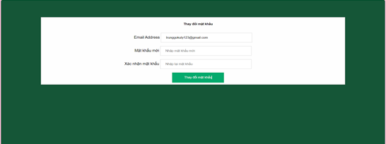

# WEBSITE SELLING MILK

Simple website created with pure php
## Instruction
  This is a website that sells dairy products. Consumers can buy all dairy products from brands online.

## Technologies Used

This is a product on the WEB that sells used milk:
+ **Frontend:** HTML, CSS, JS, Bootstrap, jQuery
+ **Backend:** PHP

## Run Locally

Clone the project

```bash
  git clone https://github.com/NguyenTrung2002/TDQMilk.git
```

Go to the project directory

```bash
  cd my-project
```

Put the project into Xampp's htdocs folder to launch


Import **web_salemilk.sql** into your database
Log in to the admin account:
+ **Username:** admin
+ **Password:** Trung05092002
You can create your admin's account but you must set your admin'username = admin.
## DEMO
#### User
**User interface**


**Registration interface**


**Login interface**


**Forgot password interface**




**Cart interface**


**Payment interface**


**Successful order interface**


**Information editing interface**


**Comment interface**


**Admin home page interface**


